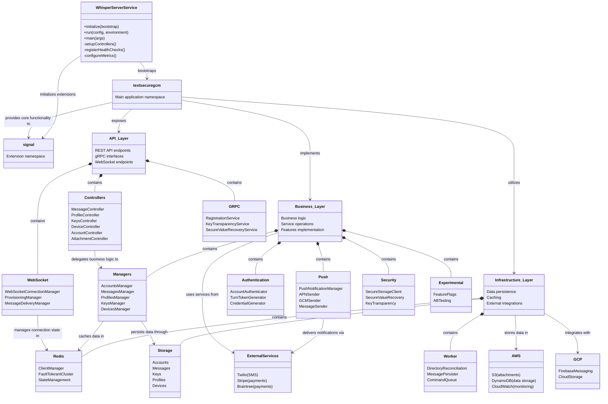

### This is a class diagram for the Signal Server, but instead of classes it uses namespaces to represent the structure and relationships of the system. It is 'core' of the application, showing how different components interact and are organized within the system.

