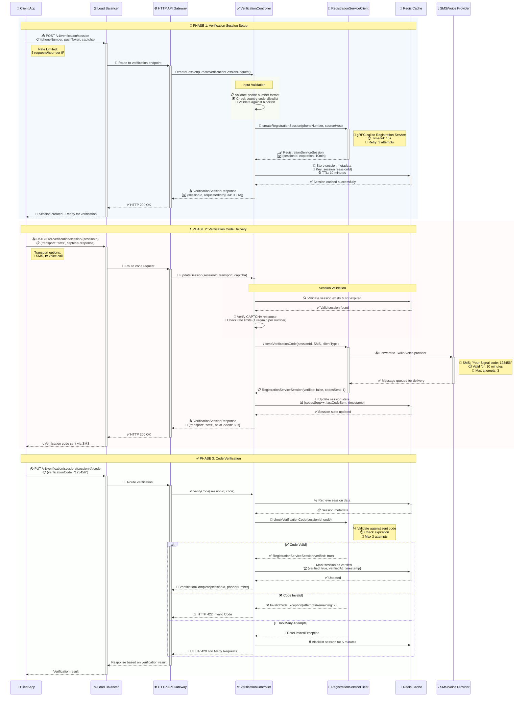

```mermaid
sequenceDiagram
    %% Enhanced participant styling with icons and clear roles
    participant C as 📱 Client App
    participant LB as ⚖️ Load Balancer
    participant API as 🌐 HTTP API Gateway
    participant VC as ✅ VerificationController
    participant RSC as 🎯 RegistrationServiceClient
    participant CACHE as 🔴 Redis Cache
    participant SMS as 📞 SMS/Voice Provider

    %% Phase 1: Initial Session Creation
    rect rgba(173, 216, 230, 0.15)
        Note over C,CACHE: 🚀 PHASE 1: Verification Session Setup
        
        C->>+LB: 📤 POST /v1/verification/session<br/>📋 {phoneNumber, pushToken, captcha}
        Note right of C: Rate Limited:<br/>5 requests/hour per IP
        
        LB->>+API: 🔄 Route to verification endpoint
        API->>+VC: 🎯 createSession(CreateVerificationSessionRequest)
        
        rect rgba(255, 255, 224, 0.3)
            Note over VC: Input Validation
            VC->>VC: 📋 Validate phone number format<br/>🌍 Check country code allowlist<br/>🚫 Validate against blocklist
        end
        
        VC->>+RSC: 🔗 createRegistrationSession(phoneNumber, sourceHost)
        Note right of RSC: 🔌 gRPC call to Registration Service<br/>⏱️ Timeout: 15s<br/>🔄 Retry: 3 attempts
        RSC-->>-VC: ✅ RegistrationServiceSession<br/>🆔 {sessionId, expiration: 10min}
        
        VC->>+CACHE: 💾 Store session metadata<br/>🔑 Key: session:{sessionId}<br/>⏰ TTL: 10 minutes
        CACHE-->>-VC: ✅ Session cached successfully
        
        VC-->>-API: 📤 VerificationSessionResponse<br/>🆔 {sessionId, requestedInfo[CAPTCHA]}
        API-->>-LB: ✅ HTTP 200 OK
        LB-->>-C: 🎉 Session created - Ready for verification
    end

    %% Phase 2: Code Request and Delivery
    rect rgba(255, 228, 225, 0.15)
        Note over C,CACHE: 📞 PHASE 2: Verification Code Delivery
        
        C->>+LB: 📤 PATCH /v1/verification/session/{sessionId}<br/>📋 {transport: "sms", captchaResponse}
        Note right of C: Transport options:<br/>📱 SMS, ☎️ Voice call
        
        LB->>+API: 🔄 Route code request
        API->>+VC: 🔄 updateSession(sessionId, transport, captcha)
        
        rect rgba(255, 240, 245, 0.3)
            Note over VC,CACHE: Session Validation
            VC->>+CACHE: 🔍 Validate session exists & not expired
            CACHE-->>-VC: ✅ Valid session found
            VC->>VC: 🔐 Verify CAPTCHA response<br/>🚦 Check rate limits (1 req/min per number)
        end
        
        VC->>+RSC: 📞 sendVerificationCode(sessionId, SMS, clientType)
        RSC->>+SMS: 📤 Forward to Twilio/Voice provider
        Note right of SMS: 📱 SMS: "Your Signal code: 123456"<br/>⏱️ Valid for: 10 minutes<br/>🔄 Max attempts: 3
        SMS-->>-RSC: ✅ Message queued for delivery
        RSC-->>-VC: 📋 RegistrationServiceSession(verified: false, codesSent: 1)
        
        VC->>+CACHE: 🔄 Update session state<br/>📊 {codesSent++, lastCodeSent: timestamp}
        CACHE-->>-VC: ✅ Session state updated
        
        VC-->>-API: 📤 VerificationSessionResponse<br/>📱 {transport: "sms", nextCodeIn: 60s}
        API-->>-LB: ✅ HTTP 200 OK
        LB-->>-C: 📞 Verification code sent via SMS
    end

    %% Phase 3: Code Verification
    rect rgba(240, 255, 240, 0.15)
        Note over C,CACHE: ✅ PHASE 3: Code Verification
        
        C->>+LB: 📤 PUT /v1/verification/session/{sessionId}/code<br/>📋 {verificationCode: "123456"}
        
        LB->>+API: 🔄 Route verification
        API->>+VC: ✅ verifyCode(sessionId, code)
        
        VC->>+CACHE: 🔍 Retrieve session data
        CACHE-->>-VC: 📋 Session metadata
        
        VC->>+RSC: 🔐 checkVerificationCode(sessionId, code)
        Note right of RSC: 🔍 Validate against sent code<br/>⏱️ Check expiration<br/>🔢 Max 3 attempts
        
        alt ✅ Code Valid
            RSC-->>VC: ✅ RegistrationServiceSession(verified: true)
            VC->>+CACHE: 🔄 Mark session as verified<br/>🏆 {verified: true, verifiedAt: timestamp}
            CACHE-->>-VC: ✅ Updated
            VC-->>API: 🎉 VerificationComplete{sessionId, phoneNumber}
        else ❌ Code Invalid
            RSC-->>VC: ❌ InvalidCodeException(attemptsRemaining: 2)
            VC-->>API: ⚠️ HTTP 422 Invalid Code
        else 🚫 Too Many Attempts
            RSC-->>VC: 🚫 RateLimitedException
            VC->>CACHE: 🔒 Blacklist session for 5 minutes
            VC-->>API: 🚫 HTTP 429 Too Many Requests
        end
        
        API-->>-LB: Response based on verification result
        LB-->>-C: Verification result
    end
```