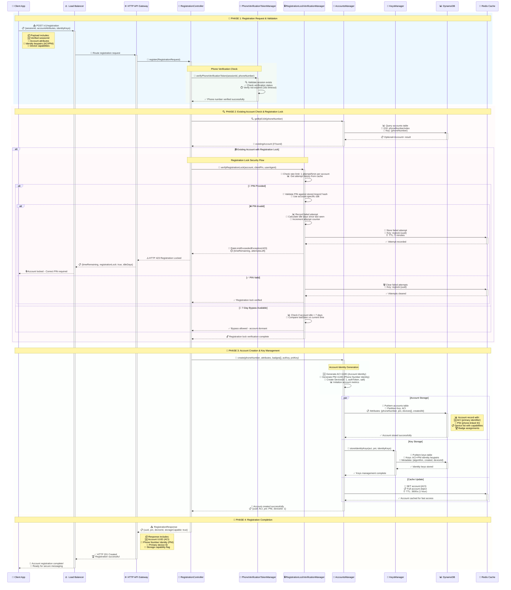

```mermaid
sequenceDiagram
    participant C as 📱 Client App
    participant LB as ⚖️ Load Balancer
    participant API as 🌐 HTTP API Gateway
    participant RC as 📝 RegistrationController
    participant PVTM as 🎫 PhoneVerificationTokenManager
    participant RLVM as 🔒 RegistrationLockVerificationManager
    participant AM as 👥 AccountsManager
    participant KM as 🔑 KeysManager
    participant DB as 📊 DynamoDB
    participant CACHE as 🔴 Redis Cache

    rect rgba(135, 206, 250, 0.15)
        Note over C,CACHE: 🚀 PHASE 1: Registration Request & Validation
        
        C->>+LB: 📤 POST /v1/registration<br/>📋 {sessionId, accountAttributes, identityKeys}
        Note right of C: 📦 Payload includes:<br/>🆔 Verified sessionId<br/>👤 Account attributes<br/>🔐 Identity keypairs (ACI/PNI)<br/>📱 Device capabilities
        
        LB->>+API: 🔄 Route registration request
        API->>+RC: 📝 register(RegistrationRequest)
        
        rect rgba(255, 255, 224, 0.3)
            Note over RC,PVTM: Phone Verification Check
            RC->>+PVTM: 🎫 verifyPhoneVerificationToken(sessionId, phoneNumber)
            PVTM->>PVTM: 🔍 Validate session exists<br/>✅ Check verification status<br/>⏱️ Verify not expired (16s timeout)
            PVTM-->>-RC: ✅ Phone number verified successfully
        end
    end

    rect rgba(255, 228, 225, 0.15)
        Note over C,CACHE: 🔍 PHASE 2: Existing Account Check & Registration Lock
        
        RC->>+AM: 🔍 getByE164(phoneNumber)
        AM->>+DB: 📊 Query accounts table<br/>🔑 GSI: phoneNumberIndex<br/>📱 Key: {phoneNumber}
        DB-->>-AM: 📋 Optional<Account> result
        AM-->>-RC: 👤 existingAccount (if found)
        
        alt 🔒 Existing Account with Registration Lock
            rect rgba(255, 240, 245, 0.3)
                Note over RC,RLVM: Registration Lock Security Flow
                RC->>+RLVM: 🔐 verifyRegistrationLock(account, clientPin, userAgent)
                RLVM->>RLVM: 🚦 Check rate limit: 1 attempt/5min per account<br/>📊 Get attempt history from cache
                
                alt 🔢 PIN Provided
                    RLVM->>RLVM: 🔐 Validate PIN against stored Argon2 hash<br/>🧂 Use account-specific salt
                    
                    alt ❌ PIN Invalid
                        RLVM->>RLVM: 📊 Record failed attempt<br/>📅 Calculate idle days since last seen<br/>🔄 Increment attempt counter
                        RLVM->>+CACHE: 💾 Store failed attempt<br/>🔑 Key: reglock:{uuid}<br/>⏰ TTL: 5 minutes
                        CACHE-->>-RLVM: ✅ Attempt recorded
                        RLVM-->>RC: 🚫 RateLimitExceededException(423)<br/>⏱️ {timeRemaining, attemptsLeft}
                        RC-->>API: ⚠️ HTTP 423 Registration Locked
                        API-->>LB: 📋 {timeRemaining, registrationLock: true, idleDays}
                        LB-->>C: 🔒 Account locked - Correct PIN required
                    else ✅ PIN Valid
                        RLVM->>+CACHE: 🗑️ Clear failed attempts<br/>🔑 Key: reglock:{uuid}
                        CACHE-->>-RLVM: ✅ Attempts cleared
                        RLVM-->>RC: ✅ Registration lock verified
                    end
                else 📅 7-Day Bypass Available
                    RLVM->>RLVM: 📊 Check if account idle > 7 days<br/>📅 Compare lastSeen vs current time
                    RLVM-->>RC: ✅ Bypass allowed - account dormant
                end
                RLVM-->>-RC: 🔓 Registration lock verification complete
            end
        end
    end

    rect rgba(240, 255, 240, 0.15)
        Note over C,CACHE: 👤 PHASE 3: Account Creation & Key Management
        
        RC->>+AM: 👤 create(phoneNumber, attributes, badges[], aciKey, pniKey)
        
        rect rgba(245, 255, 250, 0.3)
            Note over AM: Account Identity Generation
            AM->>AM: 🆔 Generate ACI UUID (Account Identity)<br/>📱 Generate PNI UUID (Phone Number Identity)<br/>🔐 Create Device(id: 1, authToken, salt)<br/>📊 Initialize account metrics
        end
        
        par Account Storage
            AM->>+DB: 💾 PutItem accounts table<br/>🔑 Partition Key: ACI<br/>📋 Attributes: {phoneNumber, pni, devices[], createdAt}
            Note right of DB: 📊 Account record with:<br/>🆔 ACI (primary identifier)<br/>📱 PNI (phone-linked ID)<br/>📋 Device list with capabilities<br/>🏆 Badge assignments
            DB-->>-AM: ✅ Account stored successfully
        and Key Storage
            AM->>+KM: 🔑 storeIdentityKeys(aci, pni, identityKeys)
            KM->>+DB: 💾 PutItem keys table<br/>🔑 Keys: ACI+PNI identity keypairs<br/>📝 Metadata: {algorithm, created, deviceId}
            DB-->>-KM: ✅ Identity keys stored
            KM-->>-AM: ✅ Keys management complete
        and Cache Update
            AM->>+CACHE: 💾 SET account:{ACI}<br/>📋 Full account object<br/>⏰ TTL: 3600s (1 hour)
            CACHE-->>-AM: ✅ Account cached for fast access
        end
        
        AM-->>-RC: 🎉 Account created successfully<br/>📋 {uuid: ACI, pni: PNI, deviceId: 1}
    end

    rect rgba(255, 248, 220, 0.15)
        Note over C,CACHE: 🎉 PHASE 4: Registration Completion
        
        RC-->>-API: 📤 RegistrationResponse<br/>📋 {uuid, pni, deviceId, storageCapable: true}
        Note right of API: 📦 Response includes:<br/>🆔 Account UUID (ACI)<br/>📱 Phone Number Identity (PNI)<br/>📱 Primary device ID<br/>💾 Storage capability flag
        
        API-->>-LB: ✅ HTTP 201 Created<br/>🏆 Registration successful
        LB-->>-C: 🎉 Account registration complete!<br/>🔐 Ready for secure messaging
    end
```