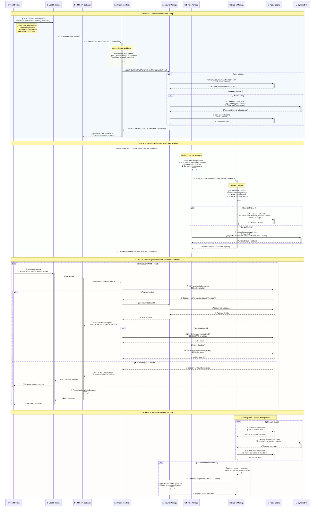

```mermaid
sequenceDiagram
    participant C as 📱 Client Device
    participant LB as ⚖️ Load Balancer
    participant API as 🌐 HTTP API Gateway
    participant AF as 🔐 AuthenticationFilter
    participant AM as 👥 AccountsManager
    participant DM as 📱 DeviceManager
    participant SM as 🎫 SessionManager
    participant CACHE as 🔴 Redis Cache
    participant DB as 📊 DynamoDB

    rect rgba(173, 216, 230, 0.15)
        Note over C,DB: 🔐 PHASE 1: Device Authentication Setup
        
        C->>+LB: 📤 PUT /v1/accounts/attributes<br/>🔐 Authorization: Basic {number}:{password}
        Note right of C: 📋 First-time device setup:<br/>📱 Device capabilities<br/>🔔 Push token registration<br/>⚙️ Client configuration
        
        LB->>+API: 🔄 Route authenticated request
        API->>+AF: 🔐 authenticateRequest(authHeader, endpoint)
        
        rect rgba(255, 255, 224, 0.3)
            Note over AF: Authentication Validation
            AF->>AF: 📋 Parse Basic Auth header<br/>📱 Extract {phoneNumber, authToken}<br/>🔍 Validate format & encoding
        end
        
        AF->>+AM: 🔍 getByE164AndAuthToken(phoneNumber, authToken)
        
        par Cache Lookup
            AM->>+CACHE: 🔍 GET account:{phoneNumber}:auth<br/>⏰ TTL check (3600s)
            CACHE-->>-AM: 📋 Cached account or cache miss
        and Database Fallback
            alt 💾 Cache Miss
                AM->>+DB: 📊 Query accounts table<br/>🔑 GSI: phoneNumberIndex<br/>🔐 Filter: authToken match
                DB-->>-AM: 📋 Account record with devices[]
                AM->>+CACHE: 💾 SET account cache<br/>⏰ TTL: 1 hour
                CACHE-->>-AM: ✅ Account cached
            end
        end
        
        AM-->>-AF: 👤 AuthenticatedAccount{uuid, deviceId, capabilities}
        AF-->>-API: ✅ Authentication successful<br/>👤 Principal: {account, device}
    end

    rect rgba(240, 255, 240, 0.15)
        Note over C,DB: 📱 PHASE 2: Device Registration & Session Creation
        
        API->>+DM: 📱 updateDeviceAttributes(account, deviceId, attributes)
        
        rect rgba(245, 255, 250, 0.3)
            Note over DM: Device State Management
            DM->>DM: 🔄 Update device capabilities<br/>📱 {GCM, APNS, WebSocket support}<br/>🔔 Update push tokens<br/>⏰ Set lastSeen timestamp
        end
        
        DM->>+SM: 🎫 createOrUpdateSession(account, device, clientInfo)
        
        rect rgba(248, 248, 255, 0.3)
            Note over SM: Session Lifecycle
            SM->>SM: 🆔 Generate session ID<br/>⏰ Set expiration (30 days)<br/>🔐 Create session token<br/>📊 Initialize session metrics
        end
        
        par Session Storage
            SM->>+CACHE: 💾 SET session:{sessionId}<br/>📋 {accountId, deviceId, created, expires}<br/>⏰ TTL: 30 days
            CACHE-->>-SM: ✅ Session cached
        and Device Update
            DM->>+DB: 🔄 UpdateItem accounts table<br/>🔑 Key: {ACI}<br/>📋 Update: devices[deviceId].{lastSeen, pushTokens}
            DB-->>-DM: ✅ Device attributes updated
        end
        
        SM-->>-DM: 🎫 SessionInfo{sessionId, token, expires}
        DM-->>-API: 📱 DeviceUpdateResponse{capabilities, sessionInfo}
    end

    rect rgba(255, 248, 220, 0.15)
        Note over C,DB: 🔄 PHASE 3: Ongoing Authentication & Session Validation
        
        loop 🔄 Subsequent API Requests
            C->>+LB: 📤 Any API Request<br/>🔐 Authorization: Bearer {sessionToken}
            LB->>+API: 🔄 Route request
            API->>+AF: 🔐 validateSession(bearerToken)
            
            AF->>+CACHE: 🔍 GET session:{tokenHash}<br/>⏰ Check expiration
            
            alt ✅ Valid Session
                CACHE-->>AF: 📋 Session data{accountId, deviceId, scope[]}
                AF->>+AM: 🔍 getAccount(accountId)
                AM->>+CACHE: 🔍 Account lookup (cached)
                CACHE-->>-AM: 👤 Account details
                AM-->>-AF: ✅ Valid account
                AF-->>API: ✅ Authenticated request<br/>👤 Principal: {account, device, session}
                
                par Session Refresh
                    AF->>+CACHE: 🔄 EXPIRE session:{tokenHash}<br/>⏰ Extend TTL by usage
                    CACHE-->>-AF: ✅ TTL extended
                and Activity Tracking
                    AF->>+CACHE: 📊 INCR activity:{accountId}:{date}<br/>⏰ TTL: 24 hours
                    CACHE-->>-AF: 📈 Activity recorded
                end
                
            else ❌ Invalid/Expired Session
                CACHE-->>AF: 🚫 Session not found or expired
                AF-->>API: ⚠️ HTTP 401 Unauthorized<br/>🔐 WWW-Authenticate: Bearer
                API-->>LB: 🚫 Authentication required
                LB-->>C: 🔐 Re-authentication needed
            end
            
            API->>API: 🎯 Process authenticated request
            API-->>-LB: 📤 API response
            LB-->>-C: ✅ Request completed
        end
    end

    rect rgba(255, 235, 235, 0.15)
        Note over C,DB: 🔄 PHASE 4: Session Cleanup & Security
        
        Note over SM,CACHE: 🧹 Background Session Management
        
        loop ⏰ Every 6 hours
            SM->>+CACHE: 🔍 SCAN expired sessions<br/>🗑️ TTL < current time
            CACHE-->>-SM: 📋 List of expired sessions
            
            SM->>+DB: 🧹 Cleanup session references<br/>🗑️ Remove from device records
            DB-->>-SM: ✅ Cleanup complete
            
            SM->>+CACHE: 📊 Collect session metrics<br/>📈 Active sessions, device types
            CACHE-->>-SM: 📊 Metrics data
        end
        
        alt 🚨 Security Event Detection
            SM->>SM: 🔍 Detect suspicious activity<br/>📱 Multiple devices, geo-anomalies
            SM->>+AM: 🚨 triggerSecurityReview(accountId, event)
            AM->>AM: 🔐 Revoke suspicious sessions<br/>📧 Send security notification
            AM-->>-SM: ✅ Security review complete
        end
    end
```