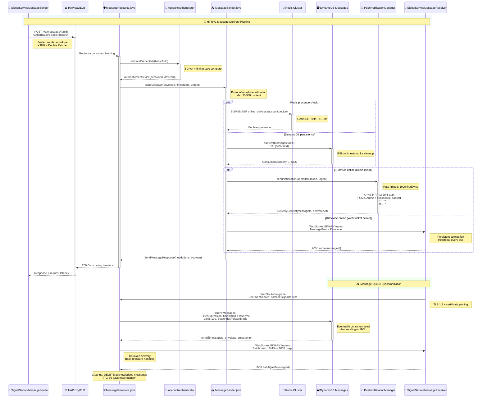
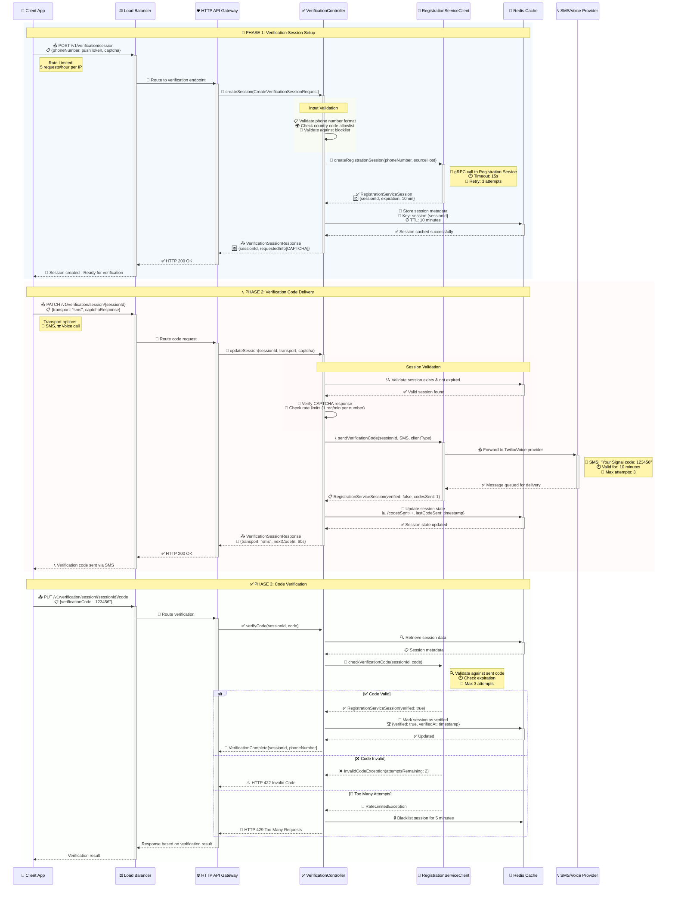
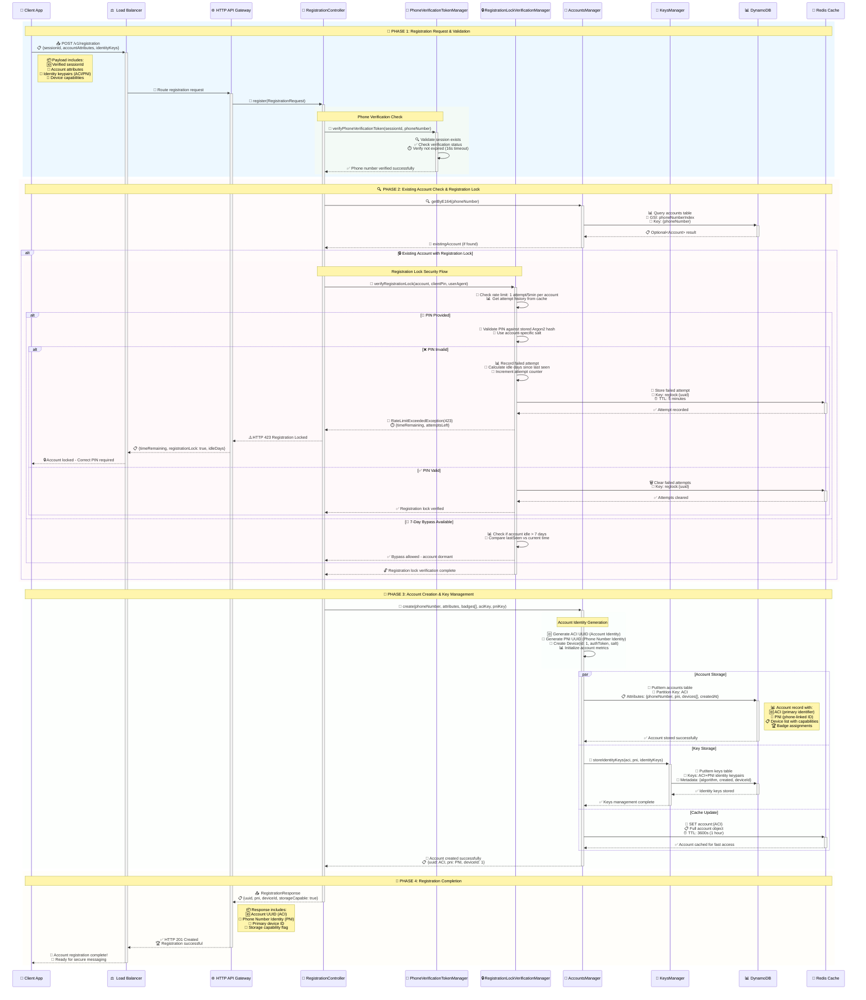
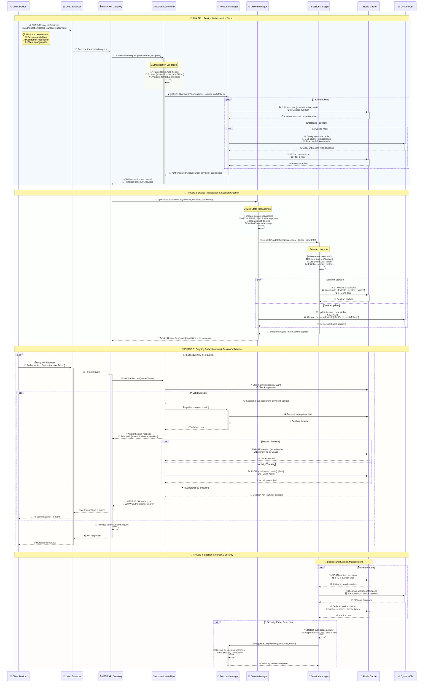

# System Dynamics Diagram

## 1. Message Sending and Delivery Sequence

## 2. 🔐 Signal Server Registration & Authentication Flow

### 2.1 📱Phone Number Verification

### 2.2 👤 Account Registration

### 2.3 🔐 Device Authentication & Session Management

## 3. System Infrastructure and Service Management

```mermaid
sequenceDiagram
%% Enhanced styling for better visual hierarchy
    participant MAIN as 🚀 Main Application
    participant WSS as 🌐 WhisperServerService
    participant ENV as 🔧 Environment Manager
    participant LIFECYCLE as ♻️ Lifecycle Manager
    participant CONFIG as ⚙️ Configuration Manager
    participant DYNCONFIG as 🔄 DynamicConfiguration
    participant REDIS as 🔴 Redis Clusters
    participant DYNAMO as 📊 DynamoDB
    participant EXEC as ⚡ Executor Services
    participant SERVICES as 🎯 Business Services
    participant CONTROLLERS as 🎮 Controllers
    participant SERVERS as 🖥️ Server Infrastructure
    participant HEALTH as 💚 Health Checks
    participant METRICS as 📈 Metrics System
%% Color-coded sections for better visual flow
    rect rgba(135, 206, 250, 0.1)
        Note over MAIN, METRICS: 🚀 PHASE 1: System Initialization
        MAIN ->>+ WSS: 🎬 run(configuration, environment)

        rect rgba(255, 255, 224, 0.3)
            Note over WSS, CONFIG: Configuration Loading
            WSS ->>+ CONFIG: 📂 Load configuration files
            CONFIG ->> CONFIG: 📖 Parse YAML configuration
            CONFIG ->> CONFIG: ✅ Validate configuration parameters
            CONFIG -->>- WSS: ✅ Configuration loaded
        end

        rect rgba(240, 248, 255, 0.3)
            Note over WSS, LIFECYCLE: Environment Setup
            WSS ->>+ ENV: 🏗️ Initialize environment
            ENV ->>+ LIFECYCLE: 🔄 Create lifecycle manager
            LIFECYCLE -->>- ENV: ✅ Lifecycle manager ready
            ENV -->>- WSS: ✅ Environment initialized
        end
    end

    rect rgba(255, 228, 225, 0.1)
        Note over WSS, METRICS: 🔗 PHASE 2: External Dependencies Setup

        par Redis Cluster Connections
            WSS ->>+ REDIS: 🔌 Initialize Redis clusters
            rect rgba(255, 240, 245, 0.3)
                REDIS ->> REDIS: 💬 Connect to messages cluster
                REDIS ->> REDIS: 🔔 Connect to push scheduler cluster
                REDIS ->> REDIS: 🚦 Connect to rate limiters cluster
                REDIS ->> REDIS: 📡 Connect to pubsub cluster
            end
            REDIS -->>- WSS: ✅ Redis clusters connected
        and DynamoDB Connections
            WSS ->>+ DYNAMO: 🔌 Initialize DynamoDB connections
            rect rgba(248, 248, 255, 0.3)
                DYNAMO ->> DYNAMO: 👥 Configure account tables
                DYNAMO ->> DYNAMO: 🔑 Configure keys tables
                DYNAMO ->> DYNAMO: 💬 Configure messages tables
            end
            DYNAMO -->>- WSS: ✅ DynamoDB connections established
        end
    end

    rect rgba(240, 255, 240, 0.1)
        Note over WSS, METRICS: ⚡ PHASE 3: Thread Pool & Executor Setup
        WSS ->>+ EXEC: 🏭 Create executor services
        rect rgba(245, 255, 250, 0.3)
            EXEC ->> EXEC: 🌐 Create main thread pool (HTTP)
            EXEC ->> EXEC: 🔄 Create async thread pool (background)
            EXEC ->> EXEC: ⏰ Create scheduled executor (periodic tasks)
            EXEC ->> EXEC: 🔌 Create WebSocket executor
            EXEC ->> EXEC: 📬 Create message delivery executor
            EXEC ->> EXEC: 🔔 Create push notification executor
        end
        EXEC -->>- WSS: ✅ Executor services ready
    end

    rect rgba(255, 248, 220, 0.1)
        Note over WSS, METRICS: 🎯 PHASE 4: Business Services Initialization

        par Core Services
            WSS ->>+ SERVICES: 🚀 Initialize core services
            rect rgba(255, 253, 240, 0.3)
                SERVICES ->> SERVICES: 👥 Create AccountsManager
                SERVICES ->> SERVICES: 💬 Create MessagesManager
                SERVICES ->> SERVICES: 🔑 Create KeysManager
                SERVICES ->> SERVICES: 🔔 Create PushNotificationManager
                SERVICES ->> SERVICES: 📤 Create MessageSender
                SERVICES ->> SERVICES: 🔐 Create AuthenticationServices
            end
            SERVICES -->>- WSS: ✅ Core services initialized
        and Dynamic Configuration
            WSS ->>+ DYNCONFIG: 🔄 Initialize dynamic configuration
            rect rgba(250, 250, 255, 0.3)
                DYNCONFIG ->> DYNCONFIG: 🔌 Connect to configuration backend
                DYNCONFIG ->> DYNCONFIG: 🏁 Load feature flags
                DYNCONFIG ->> DYNCONFIG: 🔄 Setup configuration polling
            end
            DYNCONFIG -->>- WSS: ✅ Dynamic configuration active
        end
    end

    rect rgba(230, 230, 250, 0.1)
        Note over WSS, METRICS: 🎮 PHASE 5: API Controllers & Server Setup
        WSS ->>+ CONTROLLERS: 📋 Register REST controllers
        rect rgba(240, 240, 255, 0.3)
            CONTROLLERS ->> CONTROLLERS: 💬 Register MessageController
            CONTROLLERS ->> CONTROLLERS: 👥 Register AccountController
            CONTROLLERS ->> CONTROLLERS: 🔑 Register KeysController
            CONTROLLERS ->> CONTROLLERS: 👤 Register ProfileController
            CONTROLLERS ->> CONTROLLERS: 📱 Register DeviceController
        end
        CONTROLLERS -->>- WSS: ✅ Controllers registered
        WSS ->>+ SERVERS: 🖥️ Start server infrastructure
        rect rgba(248, 248, 255, 0.3)
            SERVERS ->> SERVERS: 🌐 Configure HTTP server (Jetty)
            SERVERS ->> SERVERS: 🔌 Configure WebSocket server
            SERVERS ->> SERVERS: ⚡ Configure gRPC servers
            SERVERS ->> SERVERS: 🔐 Setup authentication filters
            SERVERS ->> SERVERS: 🔍 Configure request filters
        end
        SERVERS -->>- WSS: ✅ Servers configured
    end

    rect rgba(240, 255, 255, 0.1)
        Note over WSS, METRICS: 📊 PHASE 6: Monitoring & Health Checks

        par Metrics System
            WSS ->>+ METRICS: 📈 Initialize metrics collection
            rect rgba(245, 255, 255, 0.3)
                METRICS ->> METRICS: 📊 Setup Micrometer registry
                METRICS ->> METRICS: 📤 Configure metric exporters
                METRICS ->> METRICS: 📝 Register custom metrics
            end
            METRICS -->>- WSS: ✅ Metrics system active
        and Health Monitoring
            WSS ->>+ HEALTH: 💚 Setup health checks
            rect rgba(240, 255, 240, 0.3)
                HEALTH ->> HEALTH: 🗄️ Register database health checks
                HEALTH ->> HEALTH: 🔴 Register Redis health checks
                HEALTH ->> HEALTH: 🌐 Register external service checks
            end
            HEALTH -->>- WSS: ✅ Health monitoring active
        end
    end

    rect rgba(255, 240, 245, 0.1)
        Note over WSS, METRICS: 🎬 PHASE 7: Final Startup & Verification
        WSS ->>+ LIFECYCLE: 🚀 Start managed objects
        rect rgba(255, 245, 250, 0.3)
            par Parallel Service Startup
                LIFECYCLE ->> REDIS: ▶️ Start Redis connections
                LIFECYCLE ->> DYNAMO: ▶️ Start DynamoDB connections
                LIFECYCLE ->> EXEC: ▶️ Start executor services
            and
                LIFECYCLE ->> SERVICES: ▶️ Start business services
                LIFECYCLE ->> SERVERS: ▶️ Start HTTP/WebSocket/gRPC servers
            end
        end
        LIFECYCLE -->>- WSS: ✅ All services started
        WSS ->>+ HEALTH: 🏥 Perform startup health check
        rect rgba(240, 255, 240, 0.3)
            par Health Verification
                HEALTH ->> REDIS: ✅ Verify Redis connectivity
                HEALTH ->> DYNAMO: ✅ Verify DynamoDB connectivity
                HEALTH ->> SERVICES: ✅ Verify service health
            end
        end
        HEALTH -->>- WSS: 💚 System healthy
        WSS -->>- MAIN: 🎉 Application startup complete
    end

    rect rgba(250, 250, 250, 0.1)
        Note over MAIN, METRICS: 🔄 RUNTIME: Normal Operation

        loop 🔄 Continuous Monitoring
            rect rgba(255, 255, 255, 0.3)
                par Ongoing Health & Metrics
                    HEALTH ->> REDIS: 💓 Periodic health checks
                    HEALTH ->> DYNAMO: 💓 Periodic health checks
                    HEALTH ->> SERVICES: 💓 Monitor service health
                and
                    METRICS ->> METRICS: 📊 Collect and export metrics
                    DYNCONFIG ->> DYNCONFIG: 🔄 Poll for configuration changes
                    LIFECYCLE ->> LIFECYCLE: 👀 Monitor managed object health
                end
            end
        end
    end

    rect rgba(255, 235, 235, 0.1)
        Note over MAIN, METRICS: 🛑 SHUTDOWN: Graceful Termination
        MAIN ->>+ WSS: 🛑 Shutdown signal received
        WSS ->>+ LIFECYCLE: 🔄 Initiate graceful shutdown

        rect rgba(255, 240, 240, 0.3)
            Note over LIFECYCLE, SERVERS: Graceful Service Termination
            LIFECYCLE ->> SERVERS: 🚫 Stop accepting new requests
            LIFECYCLE ->> SERVERS: ⏳ Complete in-flight requests
            LIFECYCLE ->> SERVICES: 🛑 Stop business services
            LIFECYCLE ->> EXEC: 🔌 Shutdown executor services
            LIFECYCLE ->> REDIS: ❌ Close Redis connections
            LIFECYCLE ->> DYNAMO: ❌ Close DynamoDB connections
        end

        LIFECYCLE -->>- WSS: ✅ Shutdown complete
        WSS -->>- MAIN: 🏁 Application stopped
    end
```

