# 🔐 Signal Server Registration & Authentication Flow

## 📱 1. Phone Number Verification

```mermaid
sequenceDiagram
    %% Enhanced participant styling with icons and clear roles
    participant C as 📱 Client App
    participant LB as ⚖️ Load Balancer
    participant API as 🌐 HTTP API Gateway
    participant VC as ✅ VerificationController
    participant RSC as 🎯 RegistrationServiceClient
    participant CACHE as 🔴 Redis Cache
    participant SMS as 📞 SMS/Voice Provider

    %% Phase 1: Initial Session Creation
    rect rgba(173, 216, 230, 0.15)
        Note over C,CACHE: 🚀 PHASE 1: Verification Session Setup
        
        C->>+LB: 📤 POST /v1/verification/session<br/>📋 {phoneNumber, pushToken, captcha}
        Note right of C: Rate Limited:<br/>5 requests/hour per IP
        
        LB->>+API: 🔄 Route to verification endpoint
        API->>+VC: 🎯 createSession(CreateVerificationSessionRequest)
        
        rect rgba(255, 255, 224, 0.3)
            Note over VC: Input Validation
            VC->>VC: 📋 Validate phone number format<br/>🌍 Check country code allowlist<br/>🚫 Validate against blocklist
        end
        
        VC->>+RSC: 🔗 createRegistrationSession(phoneNumber, sourceHost)
        Note right of RSC: 🔌 gRPC call to Registration Service<br/>⏱️ Timeout: 15s<br/>🔄 Retry: 3 attempts
        RSC-->>-VC: ✅ RegistrationServiceSession<br/>🆔 {sessionId, expiration: 10min}
        
        VC->>+CACHE: 💾 Store session metadata<br/>🔑 Key: session:{sessionId}<br/>⏰ TTL: 10 minutes
        CACHE-->>-VC: ✅ Session cached successfully
        
        VC-->>-API: 📤 VerificationSessionResponse<br/>🆔 {sessionId, requestedInfo[CAPTCHA]}
        API-->>-LB: ✅ HTTP 200 OK
        LB-->>-C: 🎉 Session created - Ready for verification
    end

    %% Phase 2: Code Request and Delivery
    rect rgba(255, 228, 225, 0.15)
        Note over C,CACHE: 📞 PHASE 2: Verification Code Delivery
        
        C->>+LB: 📤 PATCH /v1/verification/session/{sessionId}<br/>📋 {transport: "sms", captchaResponse}
        Note right of C: Transport options:<br/>📱 SMS, ☎️ Voice call
        
        LB->>+API: 🔄 Route code request
        API->>+VC: 🔄 updateSession(sessionId, transport, captcha)
        
        rect rgba(255, 240, 245, 0.3)
            Note over VC,CACHE: Session Validation
            VC->>+CACHE: 🔍 Validate session exists & not expired
            CACHE-->>-VC: ✅ Valid session found
            VC->>VC: 🔐 Verify CAPTCHA response<br/>🚦 Check rate limits (1 req/min per number)
        end
        
        VC->>+RSC: 📞 sendVerificationCode(sessionId, SMS, clientType)
        RSC->>+SMS: 📤 Forward to Twilio/Voice provider
        Note right of SMS: 📱 SMS: "Your Signal code: 123456"<br/>⏱️ Valid for: 10 minutes<br/>🔄 Max attempts: 3
        SMS-->>-RSC: ✅ Message queued for delivery
        RSC-->>-VC: 📋 RegistrationServiceSession(verified: false, codesSent: 1)
        
        VC->>+CACHE: 🔄 Update session state<br/>📊 {codesSent++, lastCodeSent: timestamp}
        CACHE-->>-VC: ✅ Session state updated
        
        VC-->>-API: 📤 VerificationSessionResponse<br/>📱 {transport: "sms", nextCodeIn: 60s}
        API-->>-LB: ✅ HTTP 200 OK
        LB-->>-C: 📞 Verification code sent via SMS
    end

    %% Phase 3: Code Verification
    rect rgba(240, 255, 240, 0.15)
        Note over C,CACHE: ✅ PHASE 3: Code Verification
        
        C->>+LB: 📤 PUT /v1/verification/session/{sessionId}/code<br/>📋 {verificationCode: "123456"}
        
        LB->>+API: 🔄 Route verification
        API->>+VC: ✅ verifyCode(sessionId, code)
        
        VC->>+CACHE: 🔍 Retrieve session data
        CACHE-->>-VC: 📋 Session metadata
        
        VC->>+RSC: 🔐 checkVerificationCode(sessionId, code)
        Note right of RSC: 🔍 Validate against sent code<br/>⏱️ Check expiration<br/>🔢 Max 3 attempts
        
        alt ✅ Code Valid
            RSC-->>VC: ✅ RegistrationServiceSession(verified: true)
            VC->>+CACHE: 🔄 Mark session as verified<br/>🏆 {verified: true, verifiedAt: timestamp}
            CACHE-->>-VC: ✅ Updated
            VC-->>API: 🎉 VerificationComplete{sessionId, phoneNumber}
        else ❌ Code Invalid
            RSC-->>VC: ❌ InvalidCodeException(attemptsRemaining: 2)
            VC-->>API: ⚠️ HTTP 422 Invalid Code
        else 🚫 Too Many Attempts
            RSC-->>VC: 🚫 RateLimitedException
            VC->>CACHE: 🔒 Blacklist session for 5 minutes
            VC-->>API: 🚫 HTTP 429 Too Many Requests
        end
        
        API-->>-LB: Response based on verification result
        LB-->>-C: Verification result
    end
```

## 👤 2. Account Registration with Enhanced Security

## 🔐 3. Device Authentication & Session Management

```mermaid
sequenceDiagram
    participant C as 📱 Client Device
    participant LB as ⚖️ Load Balancer
    participant API as 🌐 HTTP API Gateway
    participant AF as 🔐 AuthenticationFilter
    participant AM as 👥 AccountsManager
    participant DM as 📱 DeviceManager
    participant SM as 🎫 SessionManager
    participant CACHE as 🔴 Redis Cache
    participant DB as 📊 DynamoDB

    rect rgba(173, 216, 230, 0.15)
        Note over C,DB: 🔐 PHASE 1: Device Authentication Setup
        
        C->>+LB: 📤 PUT /v1/accounts/attributes<br/>🔐 Authorization: Basic {number}:{password}
        Note right of C: 📋 First-time device setup:<br/>📱 Device capabilities<br/>🔔 Push token registration<br/>⚙️ Client configuration
        
        LB->>+API: 🔄 Route authenticated request
        API->>+AF: 🔐 authenticateRequest(authHeader, endpoint)
        
        rect rgba(255, 255, 224, 0.3)
            Note over AF: Authentication Validation
            AF->>AF: 📋 Parse Basic Auth header<br/>📱 Extract {phoneNumber, authToken}<br/>🔍 Validate format & encoding
        end
        
        AF->>+AM: 🔍 getByE164AndAuthToken(phoneNumber, authToken)
        
        par Cache Lookup
            AM->>+CACHE: 🔍 GET account:{phoneNumber}:auth<br/>⏰ TTL check (3600s)
            CACHE-->>-AM: 📋 Cached account or cache miss
        and Database Fallback
            alt 💾 Cache Miss
                AM->>+DB: 📊 Query accounts table<br/>🔑 GSI: phoneNumberIndex<br/>🔐 Filter: authToken match
                DB-->>-AM: 📋 Account record with devices[]
                AM->>+CACHE: 💾 SET account cache<br/>⏰ TTL: 1 hour
                CACHE-->>-AM: ✅ Account cached
            end
        end
        
        AM-->>-AF: 👤 AuthenticatedAccount{uuid, deviceId, capabilities}
        AF-->>-API: ✅ Authentication successful<br/>👤 Principal: {account, device}
    end

    rect rgba(240, 255, 240, 0.15)
        Note over C,DB: 📱 PHASE 2: Device Registration & Session Creation
        
        API->>+DM: 📱 updateDeviceAttributes(account, deviceId, attributes)
        
        rect rgba(245, 255, 250, 0.3)
            Note over DM: Device State Management
            DM->>DM: 🔄 Update device capabilities<br/>📱 {GCM, APNS, WebSocket support}<br/>🔔 Update push tokens<br/>⏰ Set lastSeen timestamp
        end
        
        DM->>+SM: 🎫 createOrUpdateSession(account, device, clientInfo)
        
        rect rgba(248, 248, 255, 0.3)
            Note over SM: Session Lifecycle
            SM->>SM: 🆔 Generate session ID<br/>⏰ Set expiration (30 days)<br/>🔐 Create session token<br/>📊 Initialize session metrics
        end
        
        par Session Storage
            SM->>+CACHE: 💾 SET session:{sessionId}<br/>📋 {accountId, deviceId, created, expires}<br/>⏰ TTL: 30 days
            CACHE-->>-SM: ✅ Session cached
        and Device Update
            DM->>+DB: 🔄 UpdateItem accounts table<br/>🔑 Key: {ACI}<br/>📋 Update: devices[deviceId].{lastSeen, pushTokens}
            DB-->>-DM: ✅ Device attributes updated
        end
        
        SM-->>-DM: 🎫 SessionInfo{sessionId, token, expires}
        DM-->>-API: 📱 DeviceUpdateResponse{capabilities, sessionInfo}
    end

    rect rgba(255, 248, 220, 0.15)
        Note over C,DB: 🔄 PHASE 3: Ongoing Authentication & Session Validation
        
        loop 🔄 Subsequent API Requests
            C->>+LB: 📤 Any API Request<br/>🔐 Authorization: Bearer {sessionToken}
            LB->>+API: 🔄 Route request
            API->>+AF: 🔐 validateSession(bearerToken)
            
            AF->>+CACHE: 🔍 GET session:{tokenHash}<br/>⏰ Check expiration
            
            alt ✅ Valid Session
                CACHE-->>AF: 📋 Session data{accountId, deviceId, scope[]}
                AF->>+AM: 🔍 getAccount(accountId)
                AM->>+CACHE: 🔍 Account lookup (cached)
                CACHE-->>-AM: 👤 Account details
                AM-->>-AF: ✅ Valid account
                AF-->>API: ✅ Authenticated request<br/>👤 Principal: {account, device, session}
                
                par Session Refresh
                    AF->>+CACHE: 🔄 EXPIRE session:{tokenHash}<br/>⏰ Extend TTL by usage
                    CACHE-->>-AF: ✅ TTL extended
                and Activity Tracking
                    AF->>+CACHE: 📊 INCR activity:{accountId}:{date}<br/>⏰ TTL: 24 hours
                    CACHE-->>-AF: 📈 Activity recorded
                end
                
            else ❌ Invalid/Expired Session
                CACHE-->>AF: 🚫 Session not found or expired
                AF-->>API: ⚠️ HTTP 401 Unauthorized<br/>🔐 WWW-Authenticate: Bearer
                API-->>LB: 🚫 Authentication required
                LB-->>C: 🔐 Re-authentication needed
            end
            
            API->>API: 🎯 Process authenticated request
            API-->>-LB: 📤 API response
            LB-->>-C: ✅ Request completed
        end
    end

    rect rgba(255, 235, 235, 0.15)
        Note over C,DB: 🔄 PHASE 4: Session Cleanup & Security
        
        Note over SM,CACHE: 🧹 Background Session Management
        
        loop ⏰ Every 6 hours
            SM->>+CACHE: 🔍 SCAN expired sessions<br/>🗑️ TTL < current time
            CACHE-->>-SM: 📋 List of expired sessions
            
            SM->>+DB: 🧹 Cleanup session references<br/>🗑️ Remove from device records
            DB-->>-SM: ✅ Cleanup complete
            
            SM->>+CACHE: 📊 Collect session metrics<br/>📈 Active sessions, device types
            CACHE-->>-SM: 📊 Metrics data
        end
        
        alt 🚨 Security Event Detection
            SM->>SM: 🔍 Detect suspicious activity<br/>📱 Multiple devices, geo-anomalies
            SM->>+AM: 🚨 triggerSecurityReview(accountId, event)
            AM->>AM: 🔐 Revoke suspicious sessions<br/>📧 Send security notification
            AM-->>-SM: ✅ Security review complete
        end
    end
```

## 🛠️ Technical Implementation Details

## Technical Notes

### Database Schema
- **Accounts Table**: Partition key: `ACI UUID`, GSI: `phoneNumber`
- **Keys Table**: Stores ACI/PNI identity keys and signed prekeys
- **Cache TTL**: 1 hour for account data, 10 minutes for verification sessions

### Security Features
- **Registration Lock**: PIN-based protection, 7-day bypass window
- **Rate Limiting**: 1 verification attempt per 5 minutes
- **Token Validation**: HMAC-SHA256 salted token verification
- **Device Expiry**: 30-day inactivity timeout

### Performance Optimizations
- **Redis Caching**: Account data cached to reduce DB queries
- **Connection Pooling**: HTTP/1.1 with keepalive to Registration Service
- **Circuit Breaker**: Fault tolerance for external service calls